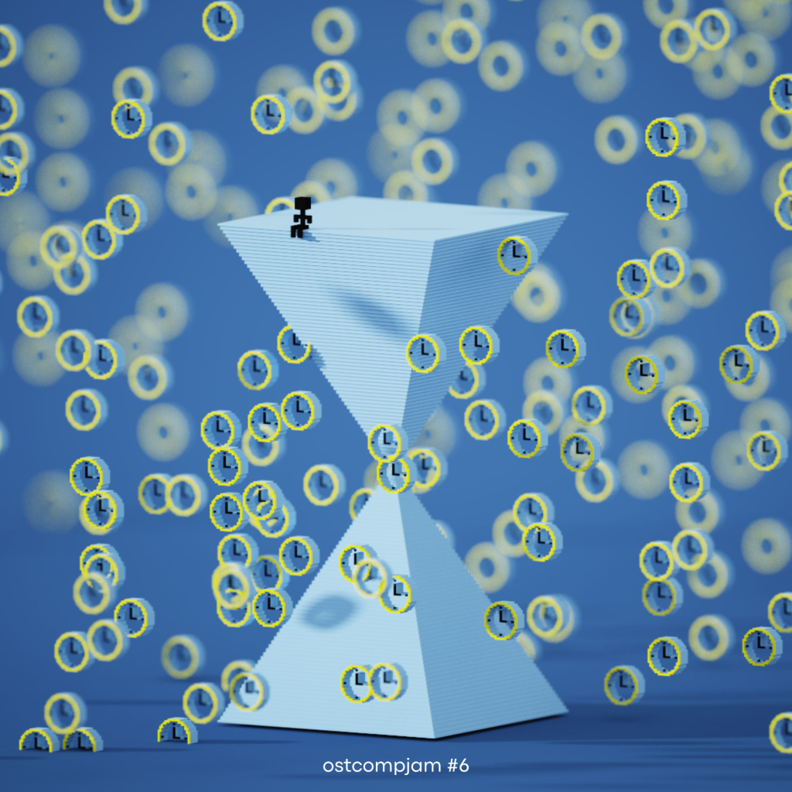

---
date:
  created: 2023-07-30
  updated: 2025-03-05

authors:
  - marcel

categories:
  - News

tags:
  - ost jam
  - itch
  - haasio
# readtime: 15
# pin: true
# thumbnail: link
# excerpt: "Uma descrição curta do post."

# social_share: true
# related_posts:
#   - post-1
#   - post-2
#   - post-3
---
# OST Composing Jam?

In the realm where music meets innovation, sometimes the most unexpected collaborations emerge. Recently, I had the privilege of delving into a unique OST composing jam with Haasio, a multi-talented individual renowned for her prowess in music, game development, concept art, UI/UX design, and, interestingly, her amphibious nature.

<!-- more -->

What’s a jam?

> In the context of music and creative collaboration, a “jam” typically refers to an informal gathering or session where musicians come together to improvise, experiment, and create music.

That jam had a theme. We could choose either the theme “Tick Tock…” or the picture theme, or both!

Our submission, titled “Countdown Showdown,” features five distinct tracks that blend classical and digital elements into a harmonious clash.

- Lord Tockula (Mareoceu)
- Infinity Before Midnight (Mareoceu)
- Lady Bellaticks (Haasio)
- Battle Tango (Haasio)
- Countdown Showdown (Mareoceu + Haasio)

“Countdown Showdown” is not your typical OST. It’s a fusion of analog and digital sounds, meticulously crafted to narrate the tale of a thrilling duel between two clockbots. Divided into two halves, each representing the contrasting worlds of analog and digital.

<figure class="wp-block-embed is-type-rich is-provider-soundcloud wp-block-embed-soundcloud wp-embed-aspect-4-3 wp-has-aspect-ratio">

<iframe title="Countdown Showdown by Haasio" width="500" height="450" scrolling="no" frameborder="no" src="https://w.soundcloud.com/player/?visual=true&#038;url=https%3A%2F%2Fapi.soundcloud.com%2Fplaylists%2F1661150787&#038;show_artwork=true&#038;maxheight=750&#038;maxwidth=500"></iframe>

<figcaption class="wp-element-caption"> </figcaption></figure>

The theme of “Tick Tock” echoes throughout the entire composition, with each track featuring rhythmic patterns that mimic the sound of ticking clocks. Furthermore, the characters portrayed in the songs are intricately themed after clocks and possess their own voices.

**Lady Bellticks** (saxophone) and **Lord Tockula** (theremin) present themselves and then battle against each other following a common leitmotif, adding depth to the narrative and reinforcing the central theme.

The first half of our submission delves into the realm of digital music production, created with precision using FL Studio. Here, electronic elements merge with dance music rhythms, creating a futuristic vibe that invites listeners to explore the possibilities of modern soundscapes.

In contrast, the second half of “Countdown Showdown” embraces the warmth of battle tango. Crafted using LMMS, these tracks exude a rich, textured sound reminiscent of traditional instrumentation. Drawing from the elegance of tango music, this half offers a timeless yet contemporary experience.

“Countdown Showdown” is more than just a collection of songs; it’s a testament to the power of collaboration and creativity.

## Thank you!

We’re thrilled to offer the soundtrack of “Countdown Showdown” under the Creative Commons license (CC BY-NC), granting permission for non-commercial projects to utilize the music.

You can download the full album at [itch.io](https://haasio.itch.io/countdownshowdown).