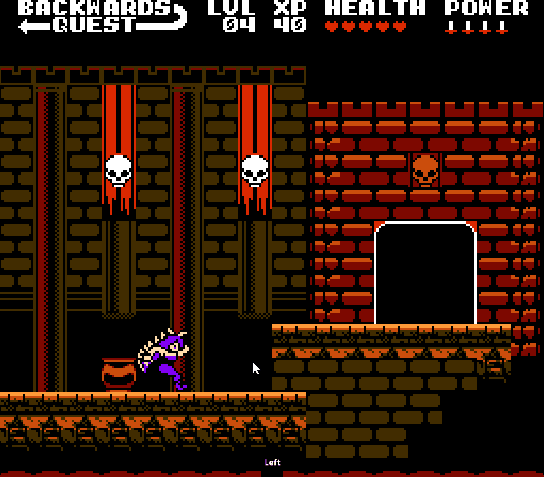

---
date:
  created: 2025-03-23
  # updated: 2025-03-05

authors:
  - marcel

categories:
  - News

tags:
  - game jam
  - byteoff
  - qa
  - l18n

# readtime: 15
# pin: true
thumbnail: https://marketplace.canva.com/EAFf5rfnPgA/1/0/800w/canva-blue-modern-eye-catching-vlog-youtube-thumbnail-XTJTyike0CE.jpg
# excerpt: "Uma descrição curta do post."

# social_share: true
# related_posts:
#   - post-1
#   - post-2
#   - post-3
---

# ByteOff V - participando como tester e tradutor

A experiência de participar QA e Tradutor de uma game jam para jogos de NES
<!-- more -->
Todos os anos, a The New 8-bit Heroes, equipe que desenvolve o NESMaker, (1) realiza a game jam entitulada ByteOff. Estamos na quinta edição. Diferente de muitas outras competições, esta tem uma maneira inusitada (e bem produzida) de revelar seus temas.
{ .annotate }

1.  O **NESmaker** é um software para PC que permite aos usuários criar novos jogos jogáveis em hardware, baseados em cartucho, para o Nintendo Entertainment System, em um ambiente de desenvolvimento moderno. Usuários sem experiência em programação podem começar a criar seus jogos dos sonhos para o NES sem escrever uma linha de código, enquanto usuários mais avançados podem usar a cadeia de ferramentas de desenvolvimento do NESmaker, chegando até a escrever motores inteiros do zero. O NESmaker pode ajudar usuários de todos os níveis de habilidade a criar novas experiências para esse clássico sistema de jogos! Os jogos criados no NESmaker funcionarão em qualquer sistema baseado em hardware capaz de rodar jogos de NES, e em qualquer emulador de NES que suporte o mapper 30.

<iframe width="100%" height="315" src="https://www.youtube.com/embed/OiYsWCyUVsY?si=AWXukZt7U4mUPpK1" title="YouTube video player" frameborder="0" allow="accelerometer; autoplay; clipboard-write; encrypted-media; gyroscope; picture-in-picture; web-share" referrerpolicy="strict-origin-when-cross-origin" allowfullscreen></iframe>

Neste ano, o tema foi "Find The Reason" (_Encontre o motivo_) e a razão de eu ter participado da maneira que participei foi por pura curiosidade sobre como é o processo testes e tradução.

## QA
Quando vi a rom do BackwardsQuest disponível para baixar e pronta para ser debugada, eu não resisti. Abri com o emulador FCEUX 2.6.6 (há quem use MESEN) e comecei a depenar o jogo.

Não demorou muito para encontrar, não um mas vários bugs. Já que estava tudo ao contrário, comecei contando os bugs de 999 e cheguei até a incrível marca de 966. Foram no total 17 versões até que o jogo ficasse "pronto".

Dentre os vários encontrados, o BUG 973 foi o que mais me diverti. Nele conseguimos escapar da matrix do jogo:

Foi muito divertido conseguir quebrar o jogo do Dale Coop, Artix, FJ e Raftonaut.

### Desafio
O maior desafio de se reportar um _bug_ é fazê-lo de uma forma que o outro consiga replicar. Uma explicação bem detalhada é boa, mas acompanhada de um vídeo ou um GIF fica melhor ainda. Utilizei O [Screen to Gif](https://www.screentogif.com/), programa gratuito que permite você gravar sua tela, editar os quadros que foram gravados e por fim exportá-los para GIF.

## Tradução
No meio do caminho, tive a ideia de também traduzir o jogo para português o que me custou algumas horas para organizar e mais horas (e copos de café) para colocar pra funcionar dentro do jogo.

A medida que eu ia jogando, ia anotando manualmente os textos em inglês e colocando numa planilha. No final da jogatina, traduzi tudo para português.

Criei uma estrutura simples para poder controlar se a tradução já havia sido colocada em jogo ou não que consiste nas seguintes colunas:

### Limitações
Na hora de traduzir, além da barreira linguística, haviam algumas limitações visto que o jogo não é inspirado em NES, mas feito para ser jogado no console infracitado. As principais limitações eram:

- Ausência de caracteres acentuados (é, í, ã, etc) e cedilha;
- Limites de texto
  - Horizontal: onde só podia escrever até 18 caracteres;
  - Limite de texto vertical onde só não podia escrever demais ou o jogo ia ficar repetindo o mesmo arquivo de diálogo

## O que aprendi?

## Referências Bibliográficas
